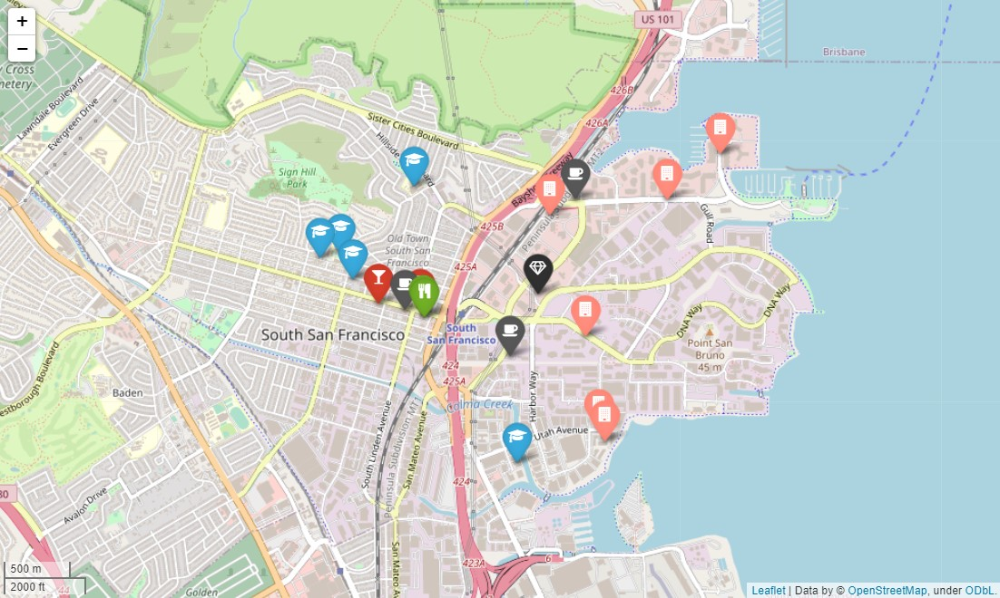

# Ironhack Project-3
----

## 1- Main objective

The goal of this project was to find the best spot/city (worldwide) to place the offices of a newly created company in the **gaming industry** taking into account the preferences of its employees.

  

## 2- Rationale
The starting point is a collection composed of roughly 18,000 companies, which needed to be **filtered** according to the needs of the company, mainly:

- To be in a city with a **gaming industry hub**: this is a gaming company, which would like to outsource and establish collaborations with other companies in the industry. Therefore, being surrounded by other gaming companies is a must.
- To be in a city with successful (>$1M money raised) companies in the design and tech industries, as it is required by roughly **40%** of the employees (designers and developers).

Thus, filtering the collection using these two initial requirements would help us identify those cities with a potential hub. Out of the ~18,000 companies, **285** are purely gaming companies (**gaming hub**). If *design* and *tech* tags are included in the filters (**gaming-tech-design hub**), then **430** companies remain. The top five cities in each case are:

  

*Note: less nº of companies are observed in San Francisco when considering the gaming-tech-design hub because an additional categorical filter was applied in order to narrow the search.*

Based on this, four cities were chosen for further analysis: San Francisco, New York, South San Francisco (for its proximity to San Francisco) and London. 

### Stealing coordinates:
- First, the filtered companies were mapped on each of these cities. 
- Then, the **most centric company (the one surrounded by all the other companies)** was chosen and its coordinates were used for requesting the remaining requirements of the employees in [Foursquare](https://location.foursquare.com/developer/reference/place-search).

The following figure shows the maps of San Francisco (left) and New York (right), and the markers correspond to the filtered companies. The red arrow indicates the most centric company.

 

## 3- API requests

Based on the employees' requirements, foursquare was used to request information. The function was built taking the following parameters: 
- The **query** in foursquare (string).
- The **city** (corresponding to the coordinates of the *most centric* company).
- The **radius** of the search (first number, in meters).
- The **category** in foursquare (second number, a foursquare ID).
- The maximum number of results to return (**limit**). 

The resuls were sorted by **distance**. The requirements of the employees can be seen below in an extracted piece of code:

```python
schools = getFoursquareCategory("school", city, 2000, 12058, token_fsq, limit=5)
clubs = getFoursquareCategory("night club", city, 2000, 10032, token_fsq, limit=5)
starbucks = getFoursquare("starbucks", city, 2000, token_fsq, limit=5)
basketball = getFoursquare("basketball stadium", city, 10000, token_fsq, limit=5)
dog = getFoursquareCategory("dog grooming", city, 10000, 11134, token_fsq, limit=5)
airport = getFoursquareCategory("airport", city, 50000, 19040, token_fsq, limit=5)
vegan = getFoursquareCategory("vegan restaurant", city, 2000, 13377, token_fsq, limit=5)
```

## 4- Building distance tables

Next, the **distance** between the chosen coordinates and each category (*query* in foursquare) was extracted from the results of the request. In the case of the **nearby companies**, which were also included in the final table, the distance was calculated using a function that considered their latitude and longitude coordinate values.

### Considerations:
- Each category was assigned a **weight** value according to their importance. This is a value that goes from 0 to 1, and adds up to 1 all categories considered. The **importance** was decided based on two main factors: 
    1. The **amount of employees** that have that requirement.
    2. How common it is to find that requirement in a city.  
- For each category, an average distance was calculated. This **favoured** having more options where to choose within a given category. The average distance was then multiplied by the respective weighting factor.
- If a requirement was not found for a given search radius (*NaN* in 'counts' and 'sum_distance'), it was **penalized** by adding that radius as the average distance (see the table below from South San Francisco as an example):


## 5- Final score

In order to calculate a final score, the weighted averaged distances were added. The final score was normalized as **percentage** based on the **minimum value of the comparison**. Thus, a score of 100% is the perfect score between the compared cities, and values (N) above 100 indicate that the categories are, on average, **+ N % more distant** from the company's coordinates.

And the winner is... **San Francisco!** The coordinates of the potential company are: (37.781929, -122.404176).  
New York came as a close second.


<br>


## 6- Building maps

Finally, interactive maps were built for each city. Markers were added and visualized with different icons and colors depending on the category. For clarification, see the legend below the pictures.

Click here to see the maps of: [San Francisco](images/sanfran_map.html), [New York](images/newyork_map.html), [South San Francisco](images/south_sanfran_map.html) and [London](images/london_map.html).

### Map of San Francisco


### Map of New York


### Map of South San Francisco


### Map of London


<br>

**Legend:**
| Category                         | Icon           | Color     |
| -------------------------------- | -------------- | --------- |
| **The location of the company**  | Diamond        | Black     |
| Airports                         | Plane          | Purple    |
| Basketball stadiums              | Football ball  | Orange    |
| Night clubs                      | Cocktail glass | Red       |
| Dog grooming                     | Paw            | Lightgray |
| Schools                          | Graduation cap | Blue      |
| Starbucks                        | Coffee mug     | Gray      |
| Vegan restaurants                | Cutlery        | Green     |
| Gaming / tech / design companies | Building       | Lightred  |
