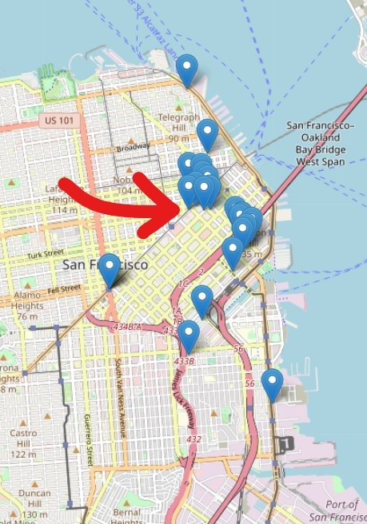
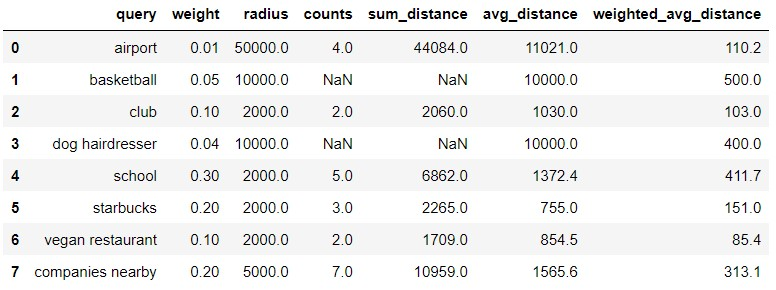

# Ironhack Project-3
----

## 1- Main objective

The goal of this project was to find the best spot (worldwide) to place the offices of a newly created company in the **gaming industry** taking into account the preferences of the employees.


## 2- Rationale
The starting point is a collection composed of roughly 18,000 companies, which needed to be **filtered** according to the needs of the company, mainly:

- To be in a city with a gaming industry hub: this is a gaming company, which woud like to outsource and establsih collaborations with other companies in the industry.
- To be in a city with successful companies in the design and tech industries, as it is required by roughly **40%** of our employees (designers and developers).

Out of the ~18,000 companies, **285** are purely gaming companies (**gaming hub**). If *design* and *tech* tags are included in the filters (**gaming-tech-design hub**), then **430** companies remain. The top cities in each case are:

 

Based on these results, four cities were chosen to conduct further analysis: San Francisco, New York, South San Francisco (for its proximity to San Francisco) and London.

#### Stealing coordinates:
- The filtered companies were mapped on each of these cities. 
- The most centric company was chosen and its coordinates used for requesting the remaining requirements in **Foursquare**.

**Figure:** maps of San Francisco (left) and New York (right).
*The red arrow indicates the most centric company.*

 

## 3- API requests

Based on the employees' requirements, Foursquare was requested for: the **query** (string, first parameter), the **city** (coordinates), the **radius** of the search (first number), the **category** in foursquare (second number) (not always used, only in the `getFoursquareCategory` function), and I **limited** the response to 5 results. The resuls were sorted by distance:

```python
schools = getFoursquareCategory("school", city, 2000, 12058, token_fsq, limit=5)
clubs = getFoursquareCategory("night club", city, 2000, 10032, token_fsq, limit=5)
starbucks = getFoursquare("starbucks", city, 2000, token_fsq, limit=5)
basketball = getFoursquare("basketball stadium", city, 10000, token_fsq, limit=5)
dog = getFoursquareCategory("dog grooming", city, 10000, 11134, token_fsq, limit=5)
airport = getFoursquareCategory("airport", city, 50000, 19040, token_fsq, limit=5)
vegan = getFoursquareCategory("vegan restaurant", city, 2000, 13377, token_fsq, limit=5)
```

## 4- Building distance tables

Next, the distance between the the chosen coordinates and each category (query) was extracted or calculated (in the case of the nearby companies, which are the companies obtained from )




